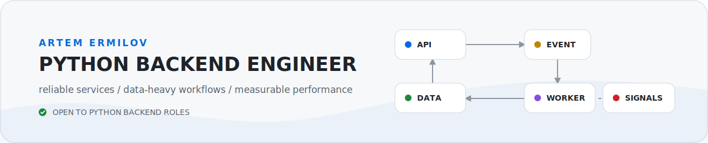

  <picture>
    <source media="(prefers-color-scheme: dark)" srcset="./assets/profile-header-dark.svg">
    <source media="(prefers-color-scheme: light)" srcset="./assets/profile-header-light.svg">
    
  </picture>

  <strong>Backend systems that stay understandable when traffic, data, and failure modes grow.</strong>

  <a href="https://t.me/artermilov">Telegram</a> ·
  <a href="https://leetcode.com/u/aermilov756/">LeetCode</a> ·
  <a href="https://hh.ru/resume/810cb277ff0e0498aa0039ed1f723675564375">Resume</a>

Python backend engineer based in Moscow

### Stack

**Backend & applied ML:** Python, Django, Django REST Framework, FastAPI, SQLAlchemy, Pydantic, REST API, asyncio, threading, multiprocessing, concurrent.futures, Celery, NLP

**Data & messaging:** PostgreSQL, MySQL, MongoDB, Redis, SQL, Kafka, RabbitMQ

**Infrastructure & delivery:** Docker, Docker Compose, Kubernetes, Linux, Nginx, Git, GitLab, GitLab CI/CD, Alembic

**Quality & teamwork:** pytest, unit testing, integration testing, Selenium, code review, Agile, Jira, Confluence

### How I work

- Take ownership of difficult tasks and follow through on commitments.
- Think in systems, communicate clearly, admit mistakes, and help teammates.
- Learn quickly, share knowledge, and automate repetitive work.

**Open to Python backend roles — remote or hybrid in Moscow.** [Let's talk on Telegram](https://t.me/artermilov).
