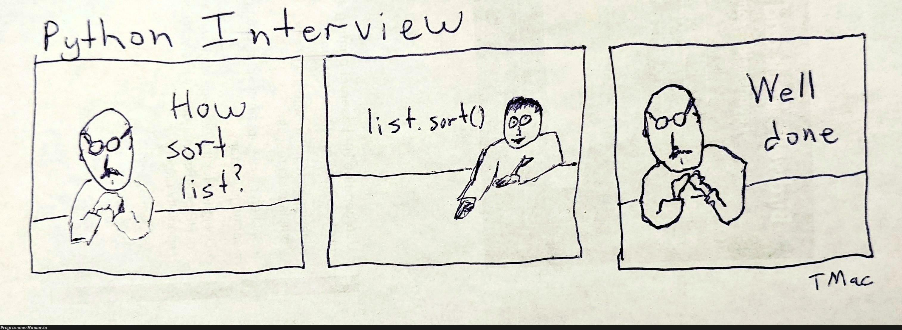

  

  <strong>Backend systems that stay understandable when traffic, data, and failure modes grow.</strong>

  
  
  

Python backend engineer based in Moscow. I build reliable, data-intensive services, integrations, asynchronous workflows, and automation. Most of my production work lives in private repositories.

### Stack

**Backend & applied ML:** Python, Django, Django REST Framework, FastAPI, SQLAlchemy, Pydantic, REST API, asyncio, threading, multiprocessing, concurrent.futures, Celery, NLP

**Data & messaging:** PostgreSQL, MySQL, MongoDB, Redis, SQL, Kafka, RabbitMQ

**Infrastructure & delivery:** Docker, Docker Compose, Kubernetes, Linux, Nginx, Git, GitLab, GitLab CI/CD, Alembic

**Quality & teamwork:** pytest, unit testing, integration testing, Selenium, code review, Agile, Jira, Confluence

### How I work

- Take ownership of difficult tasks and follow through on commitments.
- Think in systems, communicate clearly, admit mistakes, and help teammates.
- Learn quickly, share knowledge, and automate repetitive work.

**Open to Python backend roles — remote or hybrid.**

 

  

